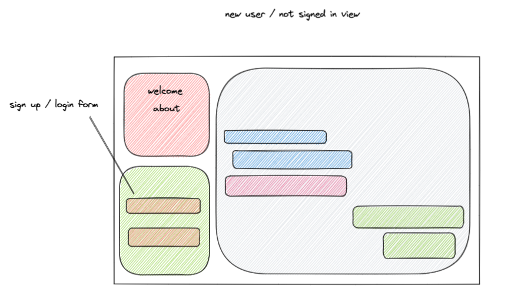

Roman
Mark
Andy

# Introduction
- The MERN stack (MongoDB, Express, React, Node) is a great stack for building a lightweight chat client - very simple and easy to use.  This repo consists of the back-end for a fully functional chat app.  Our team has picked up a lot of new skills and concepts during the building of this app.  This project can be up and running on your local in just a few easy steps
- [click for front end sibling of app](https://github.com/romanprotoliuk/p3-client)

# Features
- Authentication via jwt tokens
- Global chat - broadcast messages to any other users who access the chatroom
- Real-time chat - as soon as you send your message, all other users can view it!

# Technologies Used
- Javascript 
- socket.io
- Multer
- cloudinary
- React
- Express
- MongoDB w/mongoose
- Material UI

# DB Diagram

# App Wireframes

# How To Install
- Fork and clone this repo to your own machine (you will also need the front-end repo as well [found here](https://github.com/romanprotoliuk/p3-client))
- Change directory to your recently cloned repo, run `npm i` to install dependences listed above in Technologies Used 
- This application uses MongoDB as a database, so make sure you have that installed!
- This application also relies on [Cloudinary](https://cloudinary.com/) for image hosting, so you will need to get a API key from them.
- Create a .env file that will hold two variables:  `JWT_SECRET={YourSecret}` as well as `CLOUDINARY_URL={YourCloudinaryURL}`
- Run this file with `node index.js` to spin your server up.
- Your back end is now set up!

# User Stories
- as a user i want to create an account to start chatting
- as a user i want to login in and log out of my account
- as a user i want to be able to delete my account
- as a user i want to have a profile where i could edit my name, profile picture, and the about me section
- as a user i want to see a name, thumbnail of profile picture, and timestamp for each post

# MVP goals
- chat app usable by many users at once
- edit user profile
- live messages 

# Stretch Goals
- ability to post something other than text (images, sound, etc)
- differentiate between private/public rooms - auth lock'd rooms
- access different chat rooms

# RESTful backend chart
| Method | Path                        | Purpose                                           |
|--------|-----------------------------|---------------------------------------------------|
| GET    | `/`                         | landing / home                                    |
| GET    | `/signup`                   | sign up / registration page                       |
| POST   | `/signup`                   | create new user in db                             |
| GET    | `/login`                    | login page                                        |
| GET    | `/profile`                  | display user profile page                         |
| GET    | `/profile/:id`              | displays specific users profile                   |
| PUT    | `/profile/:id`              | update personal user profile                      |
| DELETE | `/profile/:id`              | delete personal profile                           |
| GET    | `/timeline`                 | view main 'timeline' chatroom                     |
| POST   | `/timeline`                 | add a chat to the timeline                        |
| DELETE | `/timeline/:messageId`      | remove your own message from the timeline         |
| GET    | `/rooms`                    | view all chatrooms you are subscribed to          |
| POST   | `/rooms`                    | create a new chatroom                             |
| GET    | `/rooms/:roomId`            | view specific chatroom                            |
| DELETE | `/rooms/:roomId`            | delete a specific chatroom                        |
| PUT    | `/rooms/:roomId`            | update details about a specific chatroom          |
| POST   | `/rooms/:roomId`            | add message to specific chat room                 |
| DELETE | `/rooms/:roomId/:messageId` | delete a specific message from a specific room    |
| PUT    | `/rooms/:roomId/:messageId` | edit an already-posted message in a specific room |